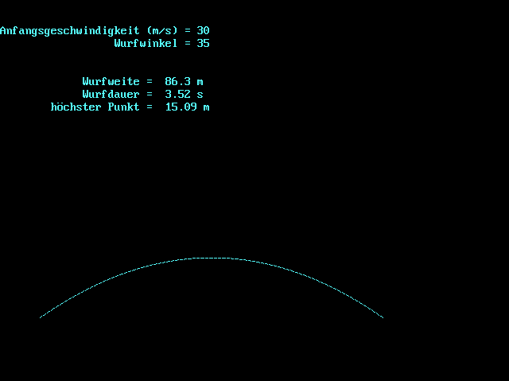

# QBasic

QBasic was my first programming language. Here I present some of my (in my perspective) valuable first steps as a programmer.

All programs are provided as source code and as a compiled binary on Ubuntu 18.04 (see instructions below to compile the code).

## Compiling

* Download and setup the [QB64 Compiler](https://github.com/Galleondragon/qb64)
* Open the QB64 application (a retro editor with a blue background)
* Use the menu to open a source file
* Press F5 to compile and execute

## Description

I group the programs into different categories:

* Computing
* Graphics
* Games
* Others

---

### Computing

#### Vep (August, 1999)

This was my very first program that converts numbers from different numerical systems into decimal numbers. It is very primitive, e.g. you have to enter the digits one by one.

#### Vep 2 (February, 2000)

A new version of the number converting program, with many improvements.

#### Binomialkoeffizienten (November, 2001)

You can choose to compute
* the number of possible combinations of drawing x items out of n
* the factorial of a number

#### Wurfbahn (December, 2001)

Given an initial speed and an angle, this program calculates and plots the trajectory of an object (not taking into account air resistance).

---

### Graphics

#### Disko (December, 1999)

This program draws random colored blocks. It has two display modes that only differ in the clear screen call being omitted in one of the modes.

#### Clock (May, 2000)

Draws some kind of clock-like looking circles and a clock hand.

#### Rose (June, 2000)

Draws a rose.

#### Star (September, 2001)

Draws a star.

---

### Games

#### Road-Roller (February, 2000)

A graphical game! You can move left and right with the numbers 4 and 6. But to make a step you have to manually press enter :)

#### The Legacy of Cthulhu (July, 2002)

An amazing text adventure! It is not only a game, it also tells a story ;) Unfortunately only in German.

---

### Other

#### Time (January, 2002)

This program simply displays the current system time.

#### Frequenz (February, 2003)

You enter a frequency, the program makes the according sound for 1 second. Crashes for values below 37. Frequencies somewhere above 20 kHz are played incorrectly.

